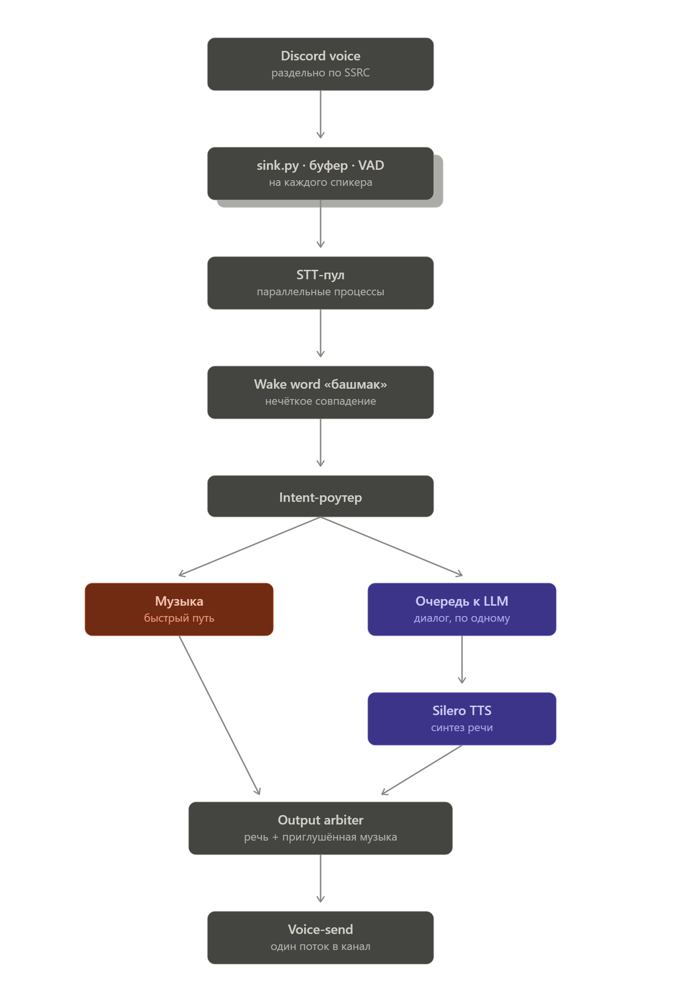

# Башмак

Голосовой бот для Discord: слушает нескольких участников одновременно,
отзывается на своё имя, отвечает голосом и управляет музыкой. Работает
полностью локально на CPU — llama.cpp, GigaAM, Silero TTS, Silero VAD.

---

## Установка

```bash
git clone https://github.com/r1l0n/bashmak bashmak
cd bashmak
bash scripts/setup.sh --systemd
```

### Флаги setup.sh

| Флаг | Назначение |
|---|---|
| `--profile balanced\|quality\|qwen\|vikhr` | Какие модели качать (по умолчанию `vikhr`) |
| `--skip-models` | Только окружение, без весов |
| `--models-only` | Только докачать веса в готовое окружение |
| `--systemd` | Установить и включить юниты |
| `--vpn` | Поставить sing-box, запустить мастер настройки, включить маркировку трафика |
| `--tunnel` | Перегенерировать юниты с маркировкой трафика |
| `--force` | Пересобрать venv и llama.cpp, перекачать модели |

### Профили

| Профиль | LLM | Когда применять |
|---|---|---|
| `vikhr` | Vikhr-YandexGPT-8B (~4.6 ГБ) | По умолчанию |
| `balanced` | GigaChat-20B-A3B (~12 ГБ) | Запасной вариант |

Профиль определяет и состав загрузки, и пути в `config.yaml`. Смена после
установки:

```bash
./scripts/setup.sh --profile quality --models-only
```

После этого нужно поправить пути в `config.yaml`. Вместе с `llm.model_path`
проверьте `llm.prompt_format` (`gigachat` или `vikhr`): разделители ролей бот
подставляет сам, и с чужим форматом модель перестаёт видеть границы ходов —
запрос не падает, а ответы начинают уезжать в чужие реплики.

---

## Токен Discord

```bash
nano .env      # DISCORD_TOKEN=...
```
- включить privileged intent **SERVER MEMBERS** — без него бот не видит ники;
- в **OAuth2 → URL Generator** выдать scope `bot` и `applications.commands`,
  права *Connect*, *Speak*, *Use Voice Activity*.

---

## Проверка и запуск

```bash
./scripts/doctor.sh
```

```bash
sudo systemctl start bashmak
journalctl -u bashmak -f
```

---

## Обход блокировки Discord по IP
### Порядок настройки

**1. Inbound на VPS.** В панели (3x-ui и аналоги) завести **VLESS + TCP +
REALITY**, flow `xtls-rprx-vision`. 

**2. sing-box на сервере.** 

```bash
sudo ./scripts/install_singbox.sh
```

**3. Подключение.** 

```bash
sudo ./scripts/setup_vpn.py
```

Проще всего вставить ссылку `vless://` из панели целиком — все поля
разбираются автоматически. Ручной ввод тоже поддерживается.

Значения проверяются до записи в конфиг: опечатка в ключе Reality роняет
sing-box на старте с `illegal base64 data at input byte 12`, следом отваливается
туннель, Discord и бот, а выглядит это как проблема с сетью.

Шаги 2 и 3 объединяет `./scripts/setup.sh --vpn`: ставит sing-box, если его
нет, запускает мастер и прописывает маркировку трафика в юните.

Канал до VPS проверяется отдельно от маршрутизации через SOCKS-инбаунд из
конфига — ожидается `code=200`:

```bash
curl -sS --socks5-hostname 127.0.0.1:10808 --max-time 15 -o /dev/null -w 'code=%{http_code}\n' https://discord.com/api/v10/gateway
```

**4. Маркировка трафика.**

```bash
./scripts/setup.sh --tunnel
```

Юниты собираются из `deploy/*.template` в момент установки, поэтому после
правки шаблона или обновления репозитория `--systemd` / `--tunnel` нужно
прогонять заново — иначе в `/etc/systemd/system` останется копия от прошлой
установки.

[deploy/tunnel.sh](deploy/tunnel.sh) маркирует трафик по cgroup юнита, а не по
пользователю: отдельный пользователь и переразбивка прав на каталог проекта не
нужны, правило действует ровно на один сервис, ssh и apt остаются на прямом
маршруте. Локальные адреса и DNS из туннеля исключены, иначе бот потерял бы
собственный `llama-server` на `127.0.0.1`.

Состояние туннеля:

```bash
sudo ./deploy/tunnel.sh status
```

### DNS после поднятия туннеля

Если на машине перестало резолвиться всё подряд (`git`, `apt` пишут «Could not
resolve host»), sing-box зарегистрировал себя в systemd-resolved как резолвер
для линка `tun-bashmak` с доменом `~.`, то есть перехватил запросы всего хоста.
`tunnel.sh up` это снимает, но перехват возвращается при каждом перезапуске
sing-box. Разовое лечение:

```bash
sudo resolvectl revert tun-bashmak
```

Признак перехвата виден в `tunnel.sh status`: строка про DNS на туннеле должна
быть пустой.

После настройки туннеля `./scripts/doctor.sh` показывает `DISCORD_TOKEN`
зелёным — эта проверка первой упирается в блокировку.

---

## Использование

Бот входит в голосовой канал по команде `/start` и дальше реагирует на речь с
упоминанием имени.

### Slash-команды

| Команда | Действие |
|---|---|
| `/start` | Войти в голосовой канал вызывающего |
| `/play <ссылка или название>` | Включить трек: ссылка на YouTube играется как есть, строка ищется на YouTube |
| `/leave` | Выйти из канала |
| `/status` | Состояние llama-server, очереди, музыки и задержек |

`/play` не требует `/start`: если бота в канале ещё нет, он заходит в канал
вызывающего сам. Трек встаёт в ту же очередь, что и голосовые команды, — дальше
им управляют «следующий», «пауза», «выключи музыку».

### Голосовые команды

| Пример | Результат |
|---|---|
| «Башмак, расскажи анекдот» | Ответ голосом |
| «Башмак, включи Кино Группа крови» | Поиск и воспроизведение |
| «Башмак, включи что-нибудь» | Бот выбирает трек сам |
| «Башмак, следующий» | Следующий трек |
| «Башмак, поставь на паузу» | Пауза |
| «Башмак, сделай потише» | Шаг громкости вниз |
| «Башмак, громкость 70» | Установка конкретного значения |
| «Башмак, выключи музыку» | Остановка воспроизведения |
| «Башмак, замолчи» | Обрыв ответа и остановка музыки без реплики |
| «Башмак, дай новый сценарий» | Кодовая фраза: бот дёргает ручку запуска игры |

Число в команде громкости распознаётся и словом: «громкость пятьдесят».

Кодовая фраза ходит по ссылке из `game.url`, а в ней токен, поэтому в
`config.example.yaml` она пустая: этот файл уезжает в репозиторий, и запускать
игру смог бы любой, кто его открыл. Ссылку прописывают в своём `config.yaml`
(он в `.gitignore`) либо в `.env` — `BASHMAK_GAME_URL` перекрывает конфиг. Пока
её нет, фраза распознаётся, но бот отвечает, что запускать ему нечего.

Имя может стоять в любом месте фразы — «включи Кино, Башмак», «включи Кино,
Башмак, пожалуйста». Имя вырезается, остальное уходит в обработку. Реплики без
имени игнорируются полностью.

Команда молчания распознаётся в вариантах "заткнись", "замолчи", "тишина",
"стоп", "уймись", "завали ебало". По ней бот обрывает фразу на
полуслове, выключает музыку и не отвечает: ответ на такую команду был бы
очередной репликой. !!!Вместе с этим сбрасывается очередь и контекст разговора.

## Архитектура




| Модуль | Назначение |
|---|---|
| [audio/sink.py](bashmak/audio/sink.py) | Приём PCM из voice-recv, разводка по говорящим |
| [audio/voice_recv_patch.py](bashmak/audio/voice_recv_patch.py) | Расшифровка DAVE и живучесть приёма поверх библиотеки |
| [audio/buffer.py](bashmak/audio/buffer.py) | Потокобезопасные буферы, граница «поток приёма ↔ asyncio» |
| [audio/vad.py](bashmak/audio/vad.py) | Silero VAD в onnxruntime, нарезка на фразы |
| [audio/listener.py](bashmak/audio/listener.py) | Опрос буферов, склейка VAD → STT |
| [stt/gigaam_worker.py](bashmak/stt/gigaam_worker.py) | GigaAM в onnxruntime, пул потоков |
| [wakeword/filter.py](bashmak/wakeword/filter.py) | Нечёткий поиск имени в тексте |
| [intent/router.py](bashmak/intent/router.py) | Регекс и LLM-фоллбэк: болтовня или команда |
| [llm/queue_manager.py](bashmak/llm/queue_manager.py) | Очередь к llama-server, один запрос за раз |
| [tts/silero_worker.py](bashmak/tts/silero_worker.py) | Silero TTS в пуле процессов, синтез по предложениям |
| [music/player.py](bashmak/music/player.py) | Очередь треков поверх микшера |
| [output/arbiter.py](bashmak/output/arbiter.py) | Единственный голосовой выход, даккинг музыки |

---

## Конфигурация

Все параметры — в [config.yaml](config.example.yaml): пороги VAD, размеры
моделей, число потоков. Промпт-персона — в
[llm/persona.py](bashmak/llm/persona.py).

### Распознавание

Распознаёт [GigaAM](https://github.com/salute-developers/GigaAM) — Conformer от
SberDevices на 240 млн весов, столько же, сколько у whisper small. Лицензия MIT,
веса в ONNX запускаются в том же onnxruntime, что и VAD.

---

### Мониторинг

Отдельное терминальное окно с нагрузкой машины и задержками:

```bash
./scripts/monitor.sh
```
---
